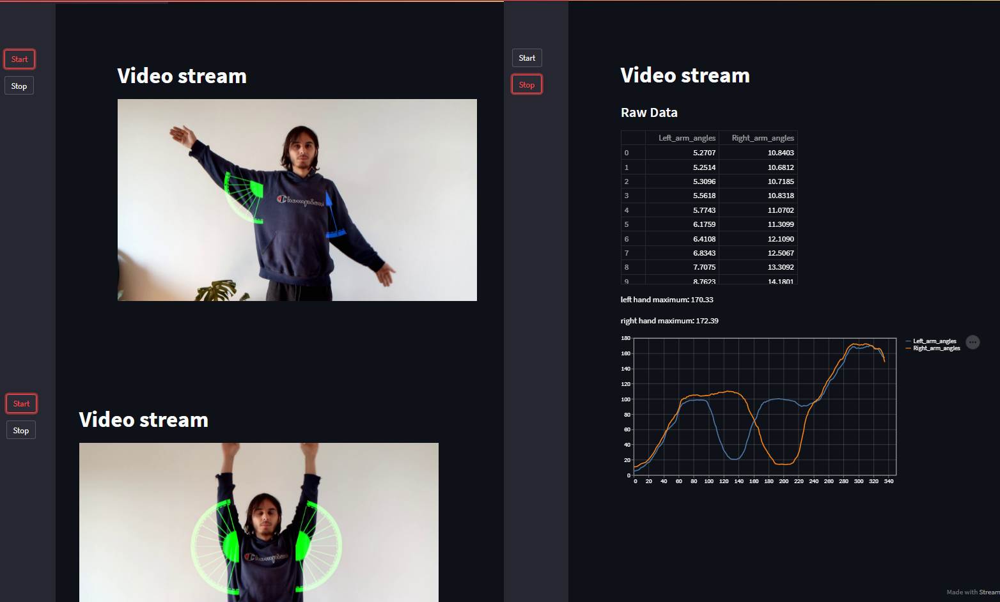

# ArmAngleDdon

A simple test of possibilites of using Streamlit to deploy CV apps.

In the app, I'm calculating the angle of arm abduction (rasing the arm sideways), and tracking the data.
The process goes something like this:

  1. Detect a person and find the pre-determined body points
  2. Extract coordinates of shoulders and elbows.
  3. Calculate the slope of lines on which shoulder-elbow pairs sit on
  4. Calculate angle between that slope and a flat horizontal line
  5. Draw an ajdustable protractor onto arms, to visualize the angles.
  6. Log the data for later viewing
  7. Display data and plot graph

Some tiny additional steps were made, but nothing too spectacular
The same principle can easily be applied to other body movement calculations.
______________________________________________________________________________________________________________________________________________

# How to run
Get your virtual environment ready and install:

    streamlit - the GUI of the app

    mediapipe - pose detector (many other things too)

    pandas - data tables

    numpy - slice multi-dimensional array with ease (needed for fast image operations)

    opencv - image manipulation

Clone the repo, take a video of yourself in front of a wall waiving your hands, or use the video of the handsome gentleman I've left in the /static folder

Run the app with "streamlit run app.py" from your command line

Press "start" to start the video and "stop" to display the gathered data.

I don't have a webcam at the moment, but if you want to try out live camera feed, simply replace 
*vid = cv2.VideoCapture(VIDEO_SOURCE)* with
*vid = cv2.VideoCapture(0)*
I haven't tried it out yet, so play around, change stuff and see what happens

______________________________________________________________________________________________________________________________________________

# Conclusion

Streamlit is good for rapid prototyping, but absolutely can't be used as a reliable CV service (for now). It has many great features and is a 
great tool to visualy display the possibilites of your idea. They offer app hosting for free, but it doesn't really refresh images so the video 
stays static for most of the time.

______________________________________________________________________________________________________________________________________________

Read more about the subjects from the documentation:

https://streamlit.io/

https://mediapipe.dev/
